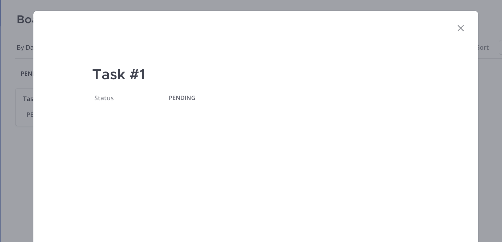
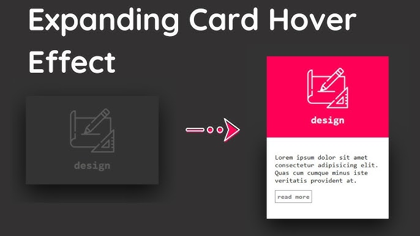

# Personal Task Management App

This project is a simple task management application built with React and Vite. The app allows users to create, read, update, and delete tasks. This project is intended as a mini-project assignment for you, applying for a software developer role at Storewise. The basic UI is provided, and you are expected to implement some functionalities which are listed below.

## Project Setup

### Prerequisites

- Node.js (version 14 or higher)
- npm (version 6 or higher)

### Installation

1. Clone the repository:
   ```bash
   git clone https://github.com/achalagarwal/storewise-engineering-assignment.git
   cd personal-task-management-app
   ```

# Candidate Tasks

## Table of Contents

There are two levels of tasks, Level 1 and Level 2, and ofcourse Level 2 is tougher than Level 1, which means you should first attempt Level 1 tasks before attempting the Level 2 tasks.

#### Level 1 Tasks (should be completed first)

<details>
<summary id="task-management">1. Task Management</summary>

### 1.1 Change UI for displaying list of tasks:

- **Currently** each task is displayed in a single and separate row
- **Task** is to display it like miniature cards in the same row, but different column (as shown below)


### 1.2 Update Task:

- Allow users to edit existing content of the tasks.

### 1.3 Delete Task:

- Allow users to manually delete tasks.
- When a task is deleted, it should be removed from both the board and the persistent storage.

</details>

<details>
<summary id="task-details">2. Task Details</summary>

### View Task Details:

- Allow users to click on a created task to view and edit its details in **modal effect**.
- The modal effect should look like this Image.
- You can add any npm dependency for the modal



</details>

<details>
<summary id="task-status">3. Task Status</summary>

### Task Status Management:

- Add statuses to tasks such as "Pending," "Complete," and "In Progress."
- Allow users to update the status of a task.

</details>

<details>
<summary id="task-status">4. Task Persistence Feature</summary>

### Task Persistence Feature:

- Ensure that tasks created by the user are saved and persist even after a page refresh, until they are manually deleted.

</details>

<details>
<summary id="bug-fixing">5. Bug Fixing</summary>

### Identify and Fix Bugs:

- When the "Add Task" button is clicked five times quickly, the count of tasks should be five.
- Currently, the task count does not match the number of rapid clicks due to a bug in the existing codebase.

</details>

<details>
<summary id="dynamic-header">6. Dynamic Header</summary>

### API Integration:

- Integrate the provided API ([API link](https://10000--main--fastapi--admin.dev.storewise.in/)) to fetch the current date.
- Display the fetched date in the header of the app.

</details>

<details>
<summary id="ui-enhancements">7. UI Enhancements</summary>

### 7.1 Hover States:

- Enhance the user interface by providing visual feedback when users hover over interactive elements.



### 7.2 Responsive Design:

- Ensure the app is responsive and looks good on all screen sizes.

### 7.3 UI Improvements:

- Add any additional UI improvements you deem necessary.

</details>

#### Level 2 Tasks (for additional points)

<details>
<summary id="dynamic-header">1. Changing Task Name</summary>

### User Should be able to write task name:

- You will have to add a feature where when we click on create task, task name should be filled at the same time by user.

</details>

<details>
<summary id="dynamic-header">2. Refactor the State</summary>

### No Internal State in Task Cards:

- The task cards should not use any state management hooks (useState, useReducer, etc.) internally.
- Make the task card have no useState or any other hook.
- Task cards should display their data passed down from the other component.
- Ensure the application continues to function correctly after the refactor.

</details>

<details>
<summary id="task-cloning">3. Task Cloning</summary>

### Clone Task:

- Added a "Clone Task" button next to the "Create Task" button.
- When the "Clone Task" button is clicked, display a dropdown menu containing the names of all existing tasks.
- When a task is selected from the dropdown, duplicate the selected task and add the duplicate to the board.
- The data of selected task should be present in the duplicate.

</details>

---

### Submission Steps:

- Clone the Repository.
- Create a New Private Repository on GitHub.
- Add the New Repository as a Remote.
- Push the cloned repository's code to the new private repository.
- Implement the tasks.
- Give "achalagarwal.01[at]gmail.com" access to the Repository.

If you face any difficulty to understand the points while attempting the assignment, feel free to contact us....
Good luck!
